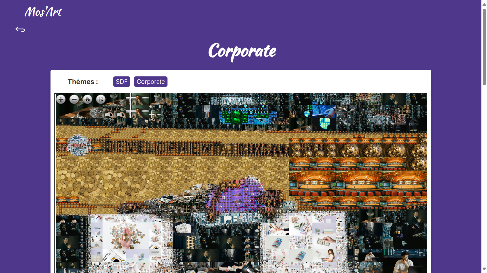

## L’équipe

* Manuela Barreto
* Valentin Billa
* Alix Duréault
* Emma Gonin
* Tutrice : Adèle Bourgeix, réunion toutes les deux semaines

## Différentes étapes mises en place pendant le projet

* Cadrage du projet
* UX du projet avec une maquette Figma
* UI du projet avec amélioration de la maquette Figma
* Développement du frontend et du backend
* Présentation

## Le projet

Le but du projet est de créer une plateforme web sur laquelle seront publiées des **mosaïques photographiques** que nous aurions créé en amont avec nos algorithmes. Notre inspiration à l’origine du projet est la mosaïque photographique **“El Beso”** de Joan Fontcuberta et Antoni Cumella à Barcelone. Nous souhaitons créer des mosaïques à impact, au message fort qui puissent inspirer à la fois les artistes et les curieux.


*El món neix en cada besada "el beso"*  - Joan Fontcuberta et Antoni Cumella

## UX

Nous avons tous les quatre assisté au cours d’expérience utilisateur, et nous en avons profité pour créer des personae et une maquette Figma.

Au cours de ces séances, nous avons notamment identifié les profils types qui utiliseraient notre service.
	Le premier profil est celui d’une **personne curieuse**. Cela correspond à tout âge, catégorie sociale, niveau de familiarité avec les outils informatiques, … L’intérêt principal de ce type d’utilisateur serait de visiter le site pour découvrir ce que l’on fait, les différentes mosaïques, leurs thèmes et leurs inspirations.
	Le deuxième profil est celui qui aimerait découvrir notre travail et **créer une mosaïque à l’aide de notre outil**. Il s’agirait cette fois d’une catégorie de personnes plus précise, professionnelle, des créatifs, des personnes dans le marketing, la communication ou autre domaine similaire. Elles seraient plus à l’aise avec les outils informatiques.

Ces deux types de profils nous ont permis d’identifier deux parcours dans l’application et ainsi faire un design l’application en fonction de ceux-ci. Avec une galerie accessible facilement avec un détail apporté pour chaque image mais une création d’image mise en avant.

[Premier prototype de l'application](https://www.figma.com/proto/1OocF4tvDTGRG4tEF7hTv8/Moz'Art?node-id=5-997&p=f&t=ybenI8ohUisCYO1K-0&scaling=scale-down&content-scaling=fixed&page-id=0%3A1&starting-point-node-id=5%3A997)

 
*Maquette initiale du site pour la partie consultation version ordinateur*

    
*Maquette initiale du site pour la partie création version ordinateur*

## UI

Durant le cours d’UI au temps 2, nous avons eu le temps de revoir notre maquette afin de la peaufiner. Nous avons commencé par travailler sur un **brief graphique** afin de mettre au clair notre idée et le graphisme autour du projet.

[Brief Graphique](https://docs.google.com/presentation/d/1RCrJ9UuxP0BsFwE5cHOZLq9hzghBWb14S6DuBMl9GH8/edit)

Cela nous a notamment permis de visualiser ce qui peut être fait par nos concurrents mais aussi chercher plus précisément des sites qui nous inspiraient pour notre visuel. Ainsi, nous avons réalisé que notre premier design ressemblait beaucoup à ceux de nos concurrents et ne se distinguait pas vraiment, mais aussi que ce design était “daté”.

Ainsi nous avons cherché à changer notre charte graphique afin de la faire correspondre d’autant plus à notre vision de notre projet et à nos inspirations. Par exemple, nous avons choisi de changer de couleur principale pour du violet afin de plus refléter une idée de créativité et pour stimuler le regard de l’utilisateur. Nous avons aussi retravaillé sur le design afin d’avoir un résultat plus moderne, design et épuré.

[Deuxième version de la maquette](https://www.figma.com/proto/1OocF4tvDTGRG4tEF7hTv8/Moz'Art?node-id=317-536&p=f&t=ybenI8ohUisCYO1K-0&scaling=scale-down&content-scaling=fixed&page-id=202%3A392&starting-point-node-id=317%3A545&show-proto-sidebar=1)

   
*Maquette finale du site pour la partie consultation version ordinateur*

Nous avons ensuite travaillé sur une version responsive pour pouvoir s’adapter à la taille d’un écran de téléphone. Cette étape est importante notamment pour le nombre de cards par ligne de la galerie ainsi que pour la page de détails.


*Maquette finale du site pour la partie consultation version téléphone*

## Backend

Le lien du projet sur Github est le suivant : https://github.com/ValentinBilla/mosaic

Afin de faire des mosaïques à base de photographies, il nous a fallu nous constituer une **base de données** de photographies **libres de droit.** Tout d’abord nous avions utilisé l’API de Google Images, pour chercher et télécharger des photos sur des thèmes précis mais nous avons vite été restreints par la limite du nombre de requêtes gratuites de l’API, à 100 requêtes par jour. Nous avons testé des outils de scraping ainsi que l’API de Wikipedia Commons mais nous avons préféré utiliser l’API du site web **Pexels** qui propose gratuitement des images haute définition avec une limite de requêtes assez large. Pour stocker les images, nous avons choisi d’implémenter une base de données **Sqlite** où nous stockons les URL des images avec leur thème et leur couleur moyenne. Seulement, pour faire fonctionner notre algorithme nous avons dû télécharger les images en local. De plus, une personne de l’équipe qui avait les mosaïques sur son propre disque dur a perdu toutes les données de son disque dur, dont les mosaïques en HD. Ainsi, pour pallier ces problèmes, nous avons utilisé un disque dur externe sur lequel nous avons téléchargé les photographies que nous avons appelées *tiles* pour pouvoir échanger les données entre nous. Les photos sont stockées dans des dossiers et triées par thèmes. La base de données contient 7 thèmes et plus de 2000 images.

Pour la première version de l’algorithme de génération des mosaïques, nous avons codé en Python en utilisant **Python Imaging Library** (PIL), une librairie de traitement d’images. Les images sont d’abord téléchargées depuis la base de données en fonction de leur thème, puis leur taille est réduite. L’algorithme utilise ces images de taille réduite (“cropped”) et récupère les niveaux médians des pixels de l’image que l’on stocke dans un dictionnaire Python { collection des niveaux médians des pixels : image }. Une fonction récursive va alors découper l’image globale de la mosaïque en rectangles de taille de plus en plus petite. Cette fonction va associer chaque rectangle (tile) à une image en fonction de la couleur moyenne de cette région de l’image référence.


Découpage de l’image référence de tortue en pixels de couleurs


Première mosaïque générée avec l’algorithme

Nous obtenons en sortie un fichier jpg qui est la mosaïque photographique. Le problème avec le format du fichier c’est que l’image n’est pas en haute définition. Nous ne pouvons pas zoomer correctement sur les différents carreaux de la mosaïque sans perdre en qualité.
De plus, nous pensions que l’on pouvait améliorer la rapidité de génération des mosaïques notamment en vue de proposer plus tard à l’utilisateur de créer lui-même sa propre mosaïque sur notre site.

Pour avoir un algorithme plus rapide et pour pallier ce problème de définition, nous avons recodé l’algorithme en utilisant Rust. Le but est d’avoir une mosaïque en sortie qu’on puisse afficher avec OpenSeaDragon. OpenSeaDragon est une librairie JavaScript pour créer des images interactives sur lesquelles on peut zoomer. L’algorithme prend en entrée les images de taille réduite ainsi que l’image de référence et renvoie en sortie des dossiers qui correspondent à des niveaux de zoom de la mosaïque. Le niveau 0 est la mosaïque, en haute définition. Le niveau 1 correspond à un zoom de l’utilisateur etc.

_[TODO] * Deuxième version et version finale de l’algorithme de génération des mosaïques en Rust avec OpenSeaDragon_

## FastApi (le backend du site web)

Le lien du projet sur Github est le suivant : https://github.com/ManuelaBarreto/Projet_Mosart

Le backend du projet a été développé en utilisant la bibliothèque *FastAPI*, un framework moderne et performant pour la création d'APIs RESTful. Le backend est responsable de la gestion des opérations liées au stockage et à la récupération des données.
En comparaison avec d'autres bibliothèques comme *Flask* ou *Django*, *FastAPI* offre une syntaxe plus moderne, une meilleure gestion des performances et une validation plus robuste des données. Ces caractéristiques ont fait de FastAPI un choix idéal pour ce projet.

L'architecture du système a été organisée de manière simple, avec un répertoire d'images, un fichier de base de données au format JSON, et un fichier principal contenant la logique de l'API. La structure du backend est la suivante :

```lua
backend/
│--- images/
│    └── image.png
│--- .gitignore
│--- data.json
│--- main.py
│--- requirements.txt
```

* *images/* : Répertoire où sont stockées les images qui seront servies par l'API.
* *data.json* : Fichier JSON servant de base de données pour stocker les informations sur les éléments, telles que l'URL de l'image, le titre, les étiquettes et la description.
* *main.py* : Fichier principal du backend où est définie la logique de l'API, y compris les routes et les fonctions de manipulation des données.
* *requirements.txt* : Fichier qui liste les dépendances nécessaires au bon fonctionnement du projet.

### Structure du Modèle de Données

```python
class Item(BaseModel):
    id: Optional\[int\] \= None
    img\_url: str
    title: Optional\[str\] \= None
    label: Optional\[list\] \= None
    description: Optional\[str\] \= None
```

La classe **Item** est un modèle de données qui utilise Pydantic pour valider les champs d'entrée. La classe comprend des champs tels que **img_url**, **title**, **label** et **description**, permettant la création d'éléments détaillés avec des informations sur les images et les descriptions.

### Exécution du Backend

Pour que le frontend fonctionne correctement, il est nécessaire de démarrer d'abord le backend. Voici les étapes pour faire fonctionner le backend :

*Installer les dépendances* :
`pip install -r requirements.txt`

*Lancer le serveur FastAPI* :
`fastapi dev main.py`

Le backend sera alors accessible à l'adresse http://127.0.0.1:8000.

Cela permettra au frontend de se connecter à l'API pour récupérer et afficher les données.

## Frontend

Nous avons initialisé le projet avec Node et create-react-app puis nous avons commencé à coder le frontend avec ReactJs. Dans un premier temps, nous nous sommes basés sur la maquette Figma du cours d’UX puis nous avons mis à jour notre code pour l’adapter à notre maquette UI finale, plus moderne.

### Utilisation de la bibliothèque *OpenSeadragon* pour le zoom des images

L'une des fonctionnalités les plus importantes du frontend est la possibilité de permettre aux utilisateurs de zoomer sur les images du mosaïque pour explorer ses détails. Cela est rendu possible grâce à l'intégration de la bibliothèque *OpenSeadragon*. Cette bibliothèque JavaScript est spécialement conçue pour visualiser de grandes images en permettant des niveaux de zoom élevés et une navigation fluide.

*OpenSeadragon* est utilisée dans le projet pour offrir une vue détaillée des images du mosaïque. Lorsqu'un utilisateur souhaite explorer une image à un niveau de zoom plus élevé, la bibliothèque charge des "tuiles" (petites sections de l'image), permettant une expérience de zoom rapide et fluide sans charger l'image entière en une seule fois. Cela améliore considérablement les performances, surtout avec des images de grande taille.

Les fonctionnalités clés de *OpenSeadragon* incluent :

1. *Zoom interactif* : Les utilisateurs peuvent zoomer et dézoomer sur l'image en utilisant la souris ou les gestes tactiles.
2. *Navigation fluide* : En déplaçant l'image, le contenu est chargé dynamiquement, permettant une exploration détaillée sans délai perceptible.
3. *Affichage d'images haute résolution* : *OpenSeadragon* prend en charge des images très grandes, offrant une expérience de visualisation de haute qualité sans sacrifier la performance.

Cette bibliothèque est particulièrement adaptée aux applications où les utilisateurs ont besoin d'explorer des images avec un niveau de détail élevé, ce qui est exactement le cas pour le projet de mosaïques, où chaque image peut comporter de nombreux petits éléments à explorer.


Image de base


Image après plusieurs zooms : elle reste d'excellente qualité

## Certaines de nos mosaïques


La spirale, qui attire et hypnotise, est une métaphore de l'addiction. Comme un tourbillon, l'utilisateur est entraîné, à la fois par le plaisir initial et par la promesse de l’évasion, mais sans fin, captif de la spirale. Les couleurs et les formes qui semblent se déformer à mesure qu’elles s’approfondissent illustrent l’illusion de maîtrise que l'on ressent lors des premières consommations, suivie de la perte progressive du contrôle à mesure que l'addiction s’installe.


Cette œuvre vise à réinterpréter le baiser comme un acte universel et profond, mais avec une approche qui l’enrichit de significations supplémentaires grâce à la mosaïque. Chaque image miniature dans la mosaïque représente une facette différente de l’amour – que ce soit des gestes tendres, des moments de complicité, des souvenirs ou des symboles culturels associés à l’intimité. Ensemble, ces images montrent la multiplicité des expériences amoureuses et des émotions liées à un baiser.

## Postérité du projet

Nous avons plusieurs défis à relever si nous souhaitons continuer le projet après l'échéance du 13 mars.

Le premier défi serait d'héberger le site web sur le serveur dédié à do-it, c'est-à-dire aioli. Le problème est que nous avons fait le parti pris d'avoir des mosaïques d'excellente qualité pour pouvoir zoomer au maximum, mais cela implique que le volume des données est énorme. Il faudrait faire des versions de mosaïques en qualité moyenne pour pouvoir héberger les données sur un serveur.

De plus, nous n'avons pas implémenté la fonctionnalité pour que les utilisateurs puissent eux-mêmes créer leurs propres mosaïques avec les images de la base de données, ce serait la prochaine étape après l'hébergement de la galerie.

Enfin, il serait intéressant d'améliorer l'algorithme de génération pour réduire le nombre d'utilisation d'une même image au sein de la mosaïque.

## Retour d'expérience

Tout d'abord, nous nous sommes séparés les tâches assez vite dans le projet selon nos affinités et ce que l'on voulait apprendre lors de ce projet. On a pû communiquer assez facilement entre nous pour régler les problèmes que l'on rencontrait dans le code et optimiser notre travail. Les réunions régulières avec Adèle nous ont réellement aidé à ajuster notre travail en fonction des attentes. En revanche, nous avons sous-estimé le temps nécessaire pour certaines tâches, en particulier la mise en place des fonctionnalités du backend et l'intégration de la bibliothèque OpenSeadragon dans le frontend. Cela a nécessité des ajustements dans notre planning et de revoir le livrable final.

Concernant les technologies abordées, le projet nous a permis d'acquérir une expérience pratique avec **FastAPI**, une technologie que l'équipe développement du site n’avait pas utilisée auparavant. Nous avons découvert comment créer une API RESTful performante, gérer les bases de données locales en JSON, et assurer une communication fluide entre le frontend et le backend.
L’utilisation de **OpenSeadragon** pour permettre le zoom sur les images était une nouveauté pour beaucoup d'entre nous. Bien qu'il y ait eu quelques défis lors de l'intégration, cela nous a permis d'apprendre une bibliothèque très puissante pour la gestion des images haute résolution. Par rapport à l'algorithme de génération des mosaïques, nous avons usé de créativité pour pouvoir faire des mosaïques qui ressemblent le plus possible à l'image de base.

Pour conclure, ce projet nous a beaucoup plu et nous avons beaucoup appris lors de ces quelques mois.